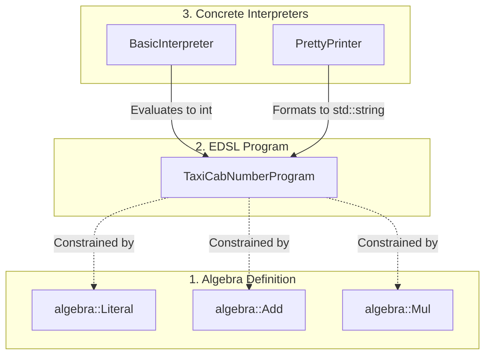

# Tagless Final in C++20

A modern demonstration of the **Tagless Final** (finally tagless) pattern in C++,
leveraging C++20 Concepts to achieve a highly extensible, type-safe, and zero-overhead embedded domain-specific language (EDSL).

---

## 💡 What is Tagless Final?

To understand **Tagless Final**, it helps to step back and look at how we construct software at a fundamental level.

### The Core Problem: Decoupling Operations and Data

At their core, computer programs are **operations performed on data**.
One of the primary keys to writing maintainable, long-lived software is setting
up our programs so we can easily extend either the operations or the data in a
decoupled way, without needing to modify or recompile any of our existing code.

How we structure this depends entirely on what we expect to change over time:

1.  **When nothing changes**: If neither our operations nor data types change,
    any architectural approach works perfectly fine.
2.  **When only operations change**: If our data types are fixed but we need to
    easily add and extend operations in the future, many developers choose a
    **Visitor Pattern** approach (often implemented using `std::variant` and
    `std::visit` in modern C++).
3.  **When only data changes**: If our operations are fixed but we want to easily
    add and extend data types in the future, many developers choose
    **Type Erasure**.

### The Challenge: When Both Need to Change

But what happens when both the operations and the data types need to change and
grow?

If a program is defined by operations on data types, and both need to be fully
extensible, we can no longer rely on simple static structures. Instead, we need
a way for users to write their own custom "programs" on top of our system. In
other words, we need to provide them with a programming language (an Embedded
Domain-Specific Language, or EDSL).

The next challenge is: how do we provide this programming language in a way
that is maintainable, extensible, and still fast and efficient?

*   **Runtime Interpreters**: The classic approach is building an AST
    (Abstract Syntax Tree) and evaluating it with a runtime interpreter.
    While flexible, runtime interpreters are carry high performance costs due to
    dynamic dispatch and object allocations.
*   **Tagless Final**: This elegant pattern aims to solve this dilemma by
    resolving the EDSL syntax and evaluation entirely at compile-time.
    However, doing so requires a host language with an exceptionally capable compiler.

### Enter Modern C++20

Historically, only highly expressive compilers for functional languages like
Haskell were capable of implementing the Tagless Final pattern cleanly. Today,
C++ (especially since C++20) stands out as the only mainstream language equipped
with a compiler capable of handling this pattern elegantly at compile-time.
Other languages like F# and Scala can implement this pattern, but they are niche
languages.

By using C++20 Concepts, we can define our language's grammar as compile-time
constraints rather than virtual interfaces or sum types. This repository
demonstrates how to implement Tagless Final in modern C++, achieving completely
zero-overhead abstractions, type-safe DSL validation, and compile-time
extensibility.

---

## Architecture & Component Design




### 1. The Algebra (Syntax)
Algebras define the abstract vocabulary of our language.
In C++20, these are represented as **Concepts**. 

For example, the addition operation in `algebra/add.h` is declared as:

```cpp
template <typename Rep, typename A>
concept Add = requires(Rep rep, std::optional<A> a, std::optional<A> b) {
  { rep.add(a, b) } -> std::same_as<std::optional<A>>;
};
```
Here, `Rep` represents the interpreter implementation,
and `A` represents the carrier type
(e.g., `int` for evaluation, `std::string` for pretty-printing).

### 2. The Program (EDSL Expressions)
A Program is an expression composed of algebra terms.
It remains generic and is parameterized by both the interpreter `P` and the carrier type `A`.

In `examples/ramanujan_number_test.cc`,
we represent Ramanujan's Taxi Cab equation ($1^3 + 12^3$) as a generic program:

```cpp
template <typename P, typename A>
  requires Add<P, A> && Literal<P, A> && Mul<P, A> && Sub<P, A> && Div<P, A>
struct TaxiCabNumberProgram1 {
  auto run() -> std::optional<A> {
    P p;
    // 1729 = 1^3 + 12^3
    return p.add(p.mul(p.mul(p.literal(1), p.literal(1)), p.literal(1)),
                 p.mul(p.mul(p.literal(12), p.literal(12)), p.literal(12)));
  }
};
```

### 3. The Interpreters (Semantics)
Interpreters provide the actual implementations for the algebra concepts.

*   **`BasicInterpreter`** (evaluates math expressions to an `int` carrier):
    ```cpp
    struct BasicInterpreter {
      auto literal(int n) -> std::optional<int> { return n; }
      auto add(std::optional<int> a, std::optional<int> b) -> std::optional<int> {
        if (!a || !b) return std::nullopt;
        return *a + *b;
      }
      // ...
    };
    ```
*   **`PrettyPrinter`** (converts the same expression to a formatted
    mathematical `std::string` carrier):
    ```cpp
    struct PrettyPrinter {
      auto literal(int n) -> std::optional<std::string> { return std::to_string(n); }
      auto add(std::optional<std::string> a, std::optional<std::string> b) -> std::optional<std::string> {
        if (!a || !b) return std::nullopt;
        return "(" + *a + " + " + *b + ")";
      }
      // ...
    };
    ```

---

## Running the Project

Ensure you have [Bazel](https://bazel.build/) installed.
You can build the codebase and run the test with:

```bash
# Run all unit tests
bazel test //...

# Run the specific Ramanujan Number examples & interpreters test
bazel test //examples:ramanujan_number_test
```
